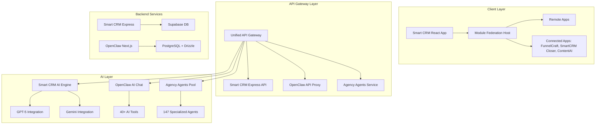
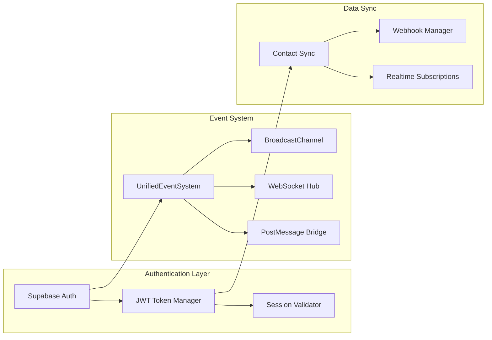
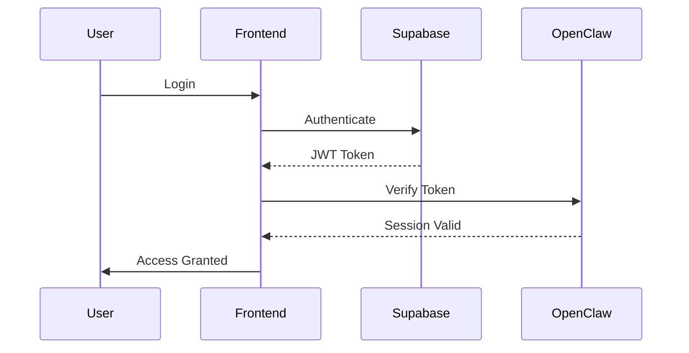

# Unified Smart CRM System Blueprint

## Complete Integration Plan for Multi-Repository Consolidation

---

## Executive Summary

This blueprint documents the comprehensive architecture for consolidating the Smart CRM ecosystem into a unified, AI-powered platform. The system comprises three primary repositories integrated through a unified API gateway and shared authentication layer.

**Repositories in Scope:**
| Repository | Location | Purpose |
|------------|----------|---------|
| crm-smartreplit | /workspaces/crm-smartreplit | Primary CRM (React/Node/Supabase) |
| openclaw-crm | /workspaces/smartcrm/external/openclaw-crm | Next.js 15 AI-First CRM |

| ai-crm-agents | /workspaces/ai-crm-agents | Python-based AI Agents |

---

## 1. System Architecture Overview

### 1.1 High-Level Architecture



### 1.2 Integration Architecture



---

## 2. Repository Analysis

### 2.1 crm-smartreplit (Primary CRM)

**Location:** `/workspaces/crm-smartreplit`

**Tech Stack:**

- Frontend: React 18 + TypeScript + Tailwind CSS
- Backend: Node.js + Express
- Database: Supabase (PostgreSQL) with RLS
- AI: OpenAI GPT-4/5, Google Gemini
- Integration: Module Federation, WebSocket, BroadcastChannel

**Key Features:**
| Category | Features |
|----------|----------|
| CRM Core | Contacts, Deals, Companies, Tasks, Activities, Notes |
| AI Tools | 58+ AI features (email composer, proposals, forecasting) |
| Communications | Email, Video Email, SMS, Phone, Calendar, Appointments |
| Analytics | Dashboards, pipeline health, revenue intelligence |
| White Label | Multi-tenant with custom branding, subdomain support |
| Connected Apps | 8 Remote Applications (FunnelCraft, SmartCRM Closer, ContentAI, etc.) |

**Database Tables (Core):**

- contacts, companies, deals, tasks, activities
- tenants, users, user_roles
- ai_function_calls, ai_workflows, ai_pending_actions
- communications, appointments, video_emails

### 2.2 openclaw-crm (AI-First CRM)

**Location:** `/workspaces/smartcrm/external/openclaw-crm`

**Tech Stack:**

- Framework: Next.js 15 (App Router) + Turborepo
- Language: TypeScript
- Database: PostgreSQL 16 + Drizzle ORM
- Auth: Better Auth
- UI: shadcn/ui + Tailwind CSS v4
- AI: OpenRouter (Claude, GPT-4o, Llama, Gemini)

**Key Features:**
| Feature | Description |
|---------|-------------|
| People & Companies | 17 attribute types management |
| Deals & Pipeline | Drag-and-drop Kanban board |
| Custom Objects | Create custom object types |
| Built-in AI Chat | 8 read tools, 5 write tools |
| REST API | 40+ endpoints for AI agent integration |
| Machine-readable docs | /llms-api.txt, /openapi.json |

**API Endpoints:**
| Endpoint | Methods | Description |
|----------|---------|-------------|
| /api/v1/objects | GET, POST | List/create objects |
| /api/v1/objects/:slug/records | GET, POST | List/create records |
| /api/v1/search | GET | Full-text search |
| /api/v1/chat/completions | POST | AI chat (SSE stream) |
| /api/v1/api-keys | GET, POST | API key management |

**Agent Divisions:**
| Division | Agents | Use Cases |
|----------|--------|-----------|
| Engineering | 22 | Frontend, Backend, Mobile, AI, DevOps, Security |
| Design | 8 | UI, UX, Brand, Visual Storyteller |
| Paid Media | 7 | PPC, Search, Tracking, Creative |
| Sales | 8 | Outbound, Discovery, Deal Strategy, Proposals |
| Marketing | 32 | Content, Social, SEO, E-commerce |
| Product | 4 | Sprint, Trends, Feedback, Nudges |
| Project Management | 6 | Producer, Shepherd, Operations |
| Testing | 8 | QA, Performance, API, Accessibility |
| Support | 6 | Response, Analytics, Finance, Legal |
| Spatial Computing | 6 | XR, Vision Pro, WebXR |
| Specialized | 28 | MCP Builder, Compliance, Salesforce |
| Game Development | 20 | Unity, Unreal, Godot, Roblox |
| Academic | 5 | Anthropologist, Geographer, Historian |

---

## 3. Integration Strategy

### 3.1 Integration Patterns

#### Pattern 1: API Federation

- Smart CRM exposes unified API at `/api/*`
- OpenClaw API available as `/api/openclaw/*` (proxied)
- Consistent authentication via JWT

#### Pattern 2: Agent Integration

- Agency agents integrated as AI skills in Smart CRM
- OpenClaw chat capabilities embedded in CRM interface
- Shared AI service layer for consistency

#### Pattern 3: Data Synchronization

- Optional: Sync contacts/deals between systems
- Use webhooks for real-time updates
- Or keep systems independent with shared UI

### 3.2 Recommended Approach

| Component   | System          | Rationale                       |
| ----------- | --------------- | ------------------------------- |
| Primary CRM | crm-smartreplit | Full-featured, 500+ features    |
| AI Chat     | openclaw-crm    | 40+ API endpoints for AI agents |

| Multi-tenant | crm-smartreplit | Complete white-label support |

---

## 4. Implementation Phases

### Phase 1: Infrastructure Setup

| Task             | Description         | Files                                     |
| ---------------- | ------------------- | ----------------------------------------- |
| API Gateway      | Unified API router  | server/routes/index.ts                    |
| Auth Integration | Supabase Auth + JWT | client/src/contexts/AuthContext.tsx       |
| Event System     | UnifiedEventSystem  | client/src/services/unifiedEventSystem.ts |

### Phase 2: OpenClaw Integration

| Task          | Description            | Files                                      |
| ------------- | ---------------------- | ------------------------------------------ |
| API Proxy     | Route /api/openclaw/\* | server/routes/openclaw.ts                  |
| Chat Widget   | Embed OpenClaw chat    | client/src/components/OpenClawChat.tsx     |
| Tool Registry | CRM tools for AI       | client/src/services/openclawToolService.ts |

### Phase 3: UI Integration

| Task           | Description         | Files                                             |
| -------------- | ------------------- | ------------------------------------------------- |
| Navbar Update  | Add new app entries | client/src/components/Navbar.tsx                  |
| Routes         | Add new pages       | client/src/App.tsx                                |
| Connected Apps | Update app list     | client/src/components/dashboard/ConnectedApps.tsx |

---

## 5. Technical Specifications

### 5.1 API Routes

```typescript
// Unified API structure
/api/crm/*           -> Smart CRM Express API
/api/openclaw/*      -> OpenClaw Next.js API (proxied)
/api/agents/*        -> Agency Agents service
/api/sync/*          -> Data synchronization
```

### 5.2 Authentication Flow



### 5.3 Event System

```typescript
interface UnifiedEventSystem {
  emit(eventType: string, data: any): Promise<any>;
  on(eventType: string, handler: Function): void;
  broadcast(channel: string, message: any): void;
}

// Event Types
type EventType =
  | 'CRM:CONTACTS:*'
  | 'CRM:DEALS:*'
  | 'NAV:ROUTE'
  | 'NAV:REMOTE_APP'
  | 'AUTOMATION:TRIGGER'
  | 'AI:INSIGHTS';
```

---

## 6. Feature Comparison Matrix

| Feature       | crm-smartreplit | openclaw-crm     | Integration        |
| ------------- | --------------- | ---------------- | ------------------ |
| Contacts      | Full            | People/Companies | Use Smart CRM      |
| Deals         | Full            | Kanban           | Use Smart CRM      |
| Tasks         | Full            | Tasks            | Use Smart CRM      |
| Custom Fields | Full            | 17 types         | Use OpenClaw       |
| AI Chat       | 58+ tools       | 13 tools         | Integrate both     |
| API for AI    | Limited         | 40+ endpoints    | Expose via Gateway |
| White Label   | Full            | None             | Use Smart CRM      |
| Multi-tenant  | Full            | Workspace        | Use Smart CRM      |

---

## 7. Module Federation Configuration

### 7.1 Current Remote Apps

| App                        | URL                                             | Status |
| -------------------------- | ----------------------------------------------- | ------ |
| **FunnelCraft AI**         | https://serene-valkyrie-fec320.netlify.app/     | Active |
| **SmartCRM Closer**        | https://stupendous-twilight-64389a.netlify.app/ | Active |
| **ContentAI**              | https://capable-mermaid-3c73fa.netlify.app/     | Active |
| **Analytics**              | https://analytics-smartcrm.netlify.app/         | Active |
| **Calendar (AI Calendar)** | https://calendar.smartcrm.vip/                  | Active |
| **Pipeline (Deals)**       | https://cheery-syrniki-b5b6ca.netlify.app/      | Active |
| **Contacts**               | Configured via RemoteContactsLoader             | Active |

### 7.2 Module Federation Components

| Component               | File                                              | Description                    |
| ----------------------- | ------------------------------------------------- | ------------------------------ |
| RemoteContactsLoader    | client/src/components/RemoteContactsLoader.tsx    | Contacts app integration       |
| RemotePipelineLoader    | client/src/components/RemotePipelineLoader.tsx    | Pipeline/Deals app integration |
| RemoteCalendar          | client/src/pages/RemoteCalendar.tsx               | AI Calendar app integration    |
| RemoteFunnelCraftLoader | client/src/components/RemoteFunnelCraftLoader.tsx | FunnelCraft marketing app      |
| RemoteContentAILoader   | client/src/components/RemoteContentAILoader.tsx   | ContentAI app                  |
| RemoteSmartCRMLoader    | client/src/components/RemoteSmartCRMLoader.tsx    | SmartCRM Closer app            |

### 7.3 OpenClaw Control of Module Federation Apps

When users interact with OpenClaw AI chat, the system can trigger actions in remote apps via the UnifiedEventSystem:

```typescript
// Example: OpenClaw tool triggers remote app navigation
const toolDefinitions = [
  {
    name: 'open_remote_app',
    description: 'Open a Module Federation remote app',
    parameters: { appName: 'string', route: 'string?' },
  },
  {
    name: 'trigger_workflow',
    description: 'Trigger automation in remote app',
    parameters: { workflowId: 'string', context: 'object' },
  },
];
```

---

## 8. Files to Create/Modify

### New Files

| File                                       | Description                  |
| ------------------------------------------ | ---------------------------- |
| client/src/services/openclawToolService.ts | Tool definitions & execution |
| client/src/services/agentLoader.ts         | Load agent prompts           |
| client/src/services/agentExecutor.ts       | Execute agent tasks          |
| client/src/pages/OpenClawChatPage.tsx      | AI chat interface            |
| client/src/pages/AgencyAgentsPage.tsx      | Agent selector page          |
| server/routes/openclaw.ts                  | API proxy routes             |

### Modify Existing

| File                                      | Changes                |
| ----------------------------------------- | ---------------------- |
| client/src/components/Navbar.tsx          | Add connected apps     |
| client/src/App.tsx                        | Add routes             |
| client/src/services/unifiedEventSystem.ts | Add event handlers     |
| server/routes/index.ts                    | Add API gateway routes |

---

## 9. Next Steps

1. **Confirm Integration Scope** - Which OpenClaw features to expose?

2. **Design Data Flow** - Keep systems independent or sync data?
3. **Plan Deployment** - Containerize both apps for production

---

## 10. Repository Locations Summary

| Repository      | Path                                       | Status             |
| --------------- | ------------------------------------------ | ------------------ |
| crm-smartreplit | /workspaces/crm-smartreplit                | Primary            |
| openclaw-crm    | /workspaces/smartcrm/external/openclaw-crm | Integration target |

| ai-crm-agents | /workspaces/ai-crm-agents | Python agents (optional) |

---

_Document Version: 3.0_
_Last Updated: March 2025_
_Status: Ready for Implementation_
