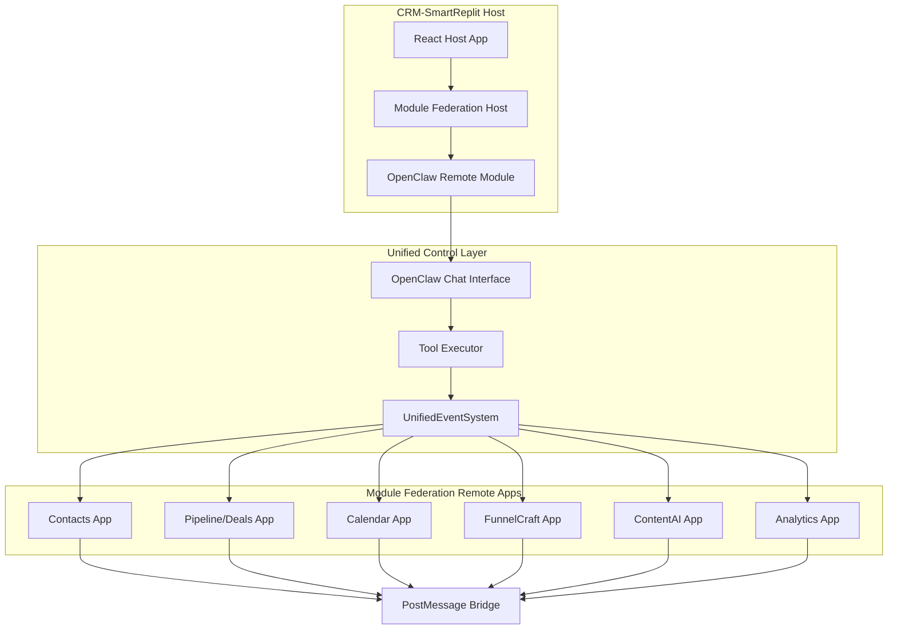

# OpenClaw-CRM Integration Architecture
## Unified Control of Module Federation Apps

---

## Executive Summary

This document outlines the architectural approach for integrating OpenClaw-CRM with the CRM-SmartReplit platform and distributing this integration across all Module Federation applications. We recommend a **shared remote module approach** rather than adding OpenClaw to each individual repository.

---

## Architecture Decision: Shared Remote Module

### Why Shared Remote Module?

| Approach | Pros | Cons |
|----------|------|------|
| **Shared Remote Module** | Single source of truth, easy updates, centralized auth, consistent behavior | Requires proper Module Federation setup |
| **Per-Repo Integration** | Complete isolation | Duplication, harder to maintain, inconsistent behavior |

**Recommended: Shared Remote Module** - This is the correct architectural approach because:

1. **Single Source of Truth**: One OpenClaw configuration for all apps
2. **Easier Maintenance**: Update once, propagate everywhere
3. **Centralized Authentication**: Unified token/session management
4. **Consistent Behavior**: All apps respond to AI commands identically
5. **Reduced Duplication**: No repeated code across repos

---

## Integration Architecture

### High-Level Data Flow



---

## Implementation Architecture

### 1. OpenClaw Remote Module Structure

```
client/src/
├── components/
│   └── openclaw/
│       ├── OpenClawChat.tsx        # Chat interface
│       ├── OpenClawProvider.tsx    # Context provider
│       ├── OpenClawToolService.ts  # Tool definitions
│       └── OpenClawRemote.tsx      # Module Federation remote
```

### 2. Module Federation Configuration

```javascript
// crm-smartreplit/client/webpack.config.js or vite.config.js
module.exports = {
  plugins: [
    new ModuleFederationPlugin({
      name: 'smartcrm_host',
      remotes: {
        openclaw: 'openclaw@https://openclaw.example.com/remoteEntry.js',
        contacts: 'contacts@https://contacts-smartcrm.netlify.app/remoteEntry.js',
        pipeline: 'pipeline@https://pipeline-smartcrm.netlify.app/remoteEntry.js',
        calendar: 'calendar@https://calendar.smartcrm.vip/remoteEntry.js',
        funnelcraft: 'funnelcraft@https://funnelcraft.netlify.app/remoteEntry.js',
        contentai: 'contentai@https://contentai.netlify.app/remoteEntry.js',
      },
      shared: {
        react: { singleton: true },
        'react-dom': { singleton: true },
      },
    }),
  ],
};
```

---

## How It Works

### Step 1: User Interacts with OpenClaw

```
User: "Create a deal for Acme Corp worth $50,000"
```

### Step 2: OpenClaw Identifies the Tool

```
Tool identified: create_deal
Parameters: { name: "Acme Corp", value: 50000, stage: "qualified" }
```

### Step 3: Tool Executor Processes Request

```typescript
// In OpenClawRemote module
const toolExecutor = async (toolName: string, params: any) => {
  // Map tool to UnifiedEventSystem event
  const event = toolMapping[toolName];
  
  // Emit event to all connected apps
  unifiedEventSystem.emit(event, params);
  
  return { success: true, result: "Deal created" };
};
```

### Step 4: UnifiedEventSystem Broadcasts to All Apps

```typescript
// UnifiedEventSystem broadcasts via BroadcastChannel + postMessage
broadcast('CRM:DEALS:CREATE', {
  name: 'Acme Corp',
  value: 50000,
  stage: 'qualified'
});
```

### Step 5: Remote Apps Receive and Execute

Each remote app subscribes to events:

```typescript
// In Pipeline Remote App
unifiedEventSystem.on('CRM:DEALS:CREATE', (data) => {
  // Create deal in pipeline app
  createDeal(data);
  // Update UI
  refreshPipeline();
});
```

---

## Tool Definitions for Module Federation Control

### Navigation Tools

```typescript
const navigationTools = [
  {
    name: 'navigate_to_app',
    description: 'Navigate to a specific Module Federation app',
    parameters: {
      app: 'contacts|pipeline|calendar|funnelcraft|contentai|analytics',
      route: '/optional-route'
    }
  },
  {
    name: 'open_contact',
    description: 'Open a specific contact in the Contacts app',
    parameters: {
      contactId: 'string'
    }
  },
  {
    name: 'show_deal',
    description: 'Show a deal in the Pipeline app',
    parameters: {
      dealId: 'string'
    }
  },
  {
    name: 'view_calendar',
    description: 'Open calendar to specific date',
    parameters: {
      date: 'YYYY-MM-DD'
    }
  }
];
```

### CRM Action Tools

```typescript
const crmActionTools = [
  {
    name: 'search_contacts',
    description: 'Search contacts across all apps',
    parameters: { query: 'string' }
  },
  {
    name: 'create_deal',
    description: 'Create a new deal',
    parameters: {
      name: 'string',
      value: 'number',
      stage: 'string',
      contactId?: 'string'
    }
  },
  {
    name: 'create_task',
    description: 'Create a task',
    parameters: {
      title: 'string',
      dueDate: 'string',
      priority: 'low|medium|high'
    }
  },
  {
    name: 'schedule_appointment',
    description: 'Schedule a meeting',
    parameters: {
      title: 'string',
      dateTime: 'string',
      attendees: 'string[]'
    }
  }
];
```

### Automation Tools

```typescript
const automationTools = [
  {
    name: 'trigger_workflow',
    description: 'Trigger an automation workflow',
    parameters: {
      workflowId: 'string',
      context: 'object'
    }
  },
  {
    name: 'send_email_sequence',
    description: 'Start an email sequence for a contact',
    parameters: {
      contactId: 'string',
      sequenceId: 'string'
    }
  },
  {
    name: 'run_ai_insights',
    description: 'Get AI insights for any entity',
    parameters: {
      entityType: 'deal|contact|company',
      entityId: 'string'
    }
  }
];
```

---

## Communication Mechanisms

### 1. BroadcastChannel (Same Browser Tab)

```typescript
// Host to all remotes in same tab
const channel = new BroadcastChannel('smartcrm_events');
channel.postMessage({ type: 'CRM:DEALS:CREATE', data: {...} });
```

### 2. postMessage (Iframe Communication)

```typescript
// For iframe-based remote apps
window.parent.postMessage({
  source: 'openclaw',
  type: 'CRM_ACTION',
  action: 'CREATE_DEAL',
  payload: {...}
}, '*');
```

### 3. Custom Event System

```typescript
// UnifiedEventSystem custom events
window.dispatchEvent(new CustomEvent('smartcrm:deal:create', {
  detail: { ... }
}));
```

---

## Required Changes Per Repository

### Option A: NO Changes to Individual Remote Repos

**This is the recommended approach!** 

The remote apps already have PostMessage bridges that can receive commands. We don't need to modify the remote repos - just ensure they listen to the UnifiedEventSystem messages.

### Option B: If Remote Apps Need Direct OpenClaw Integration

If you want each remote app to have its own OpenClaw UI, you would add the OpenClaw package to each:

```bash
# In each remote app repo
npm install @openclaw/crm-integration
```

But this is **not recommended** because:
- Duplication of AI logic
- Inconsistent behavior
- Harder to maintain

---

## Implementation Steps

### Phase 1: Create OpenClaw Remote Module

1. Create `client/src/components/openclaw/` in CRM-SmartReplit
2. Implement OpenClawChat component
3. Implement Tool Executor service
4. Connect to UnifiedEventSystem

### Phase 2: Configure Module Federation

1. Add OpenClaw as a shared module
2. Ensure remotes can consume it
3. Test cross-app communication

### Phase 3: Add Tools for Each Remote App

1. Define tools for Contacts app
2. Define tools for Pipeline app
3. Define tools for Calendar app
4. Define tools for other apps

### Phase 4: Connect Remote App Listeners

1. Ensure each remote app has PostMessage listener
2. Map events to actions
3. Test end-to-end flow

---

## File Structure

```
crm-smartreplit/
├── client/
│   └── src/
│       ├── components/
│       │   └── openclaw/
│       │       ├── OpenClawChat.tsx       # Main chat UI
│       │       ├── OpenClawProvider.tsx    # Context
│       │       ├── OpenClawToolService.ts  # Tool definitions
│       │       ├── ToolExecutor.ts         # Execute tools
│       │       └── types.ts                # TypeScript types
│       ├── services/
│       │   └── unifiedEventSystem.ts       # Event broadcasting
│       └── App.tsx                        # Add OpenClaw route
└── server/
    └── routes/
        └── openclaw.ts                    # API proxy
```

---

## Alternative: Per-Repo Integration (NOT Recommended)

If you absolutely need to add OpenClaw to each repo:

```
Each Remote Repo:
├── src/
│   ├── components/
│   │   └── openclaw/        # Copied into each repo
│   ├── hooks/
│   │   └── useOpenClaw.ts   # Copied into each repo
│   └── services/
│       └── openclawClient.ts  # Copied into each repo
```

**Problems with this approach:**
- Must update 7+ repos when OpenClaw changes
- Inconsistent versions
- Each app behaves differently
- More storage/memory used

---

## Conclusion

**Use the shared remote module approach:**
1. OpenClaw lives only in CRM-SmartReplit (host)
2. All remote apps consume it via Module Federation
3. UnifiedEventSystem broadcasts commands to all apps
4. Remote apps just need to listen to events (they already have PostMessage bridges)
5. No changes needed to individual remote repos

This provides:
- Single source of truth
- Centralized control
- Easy maintenance
- Consistent behavior
- Lower complexity

---

*Document Version: 1.0*
*Last Updated: March 2025*