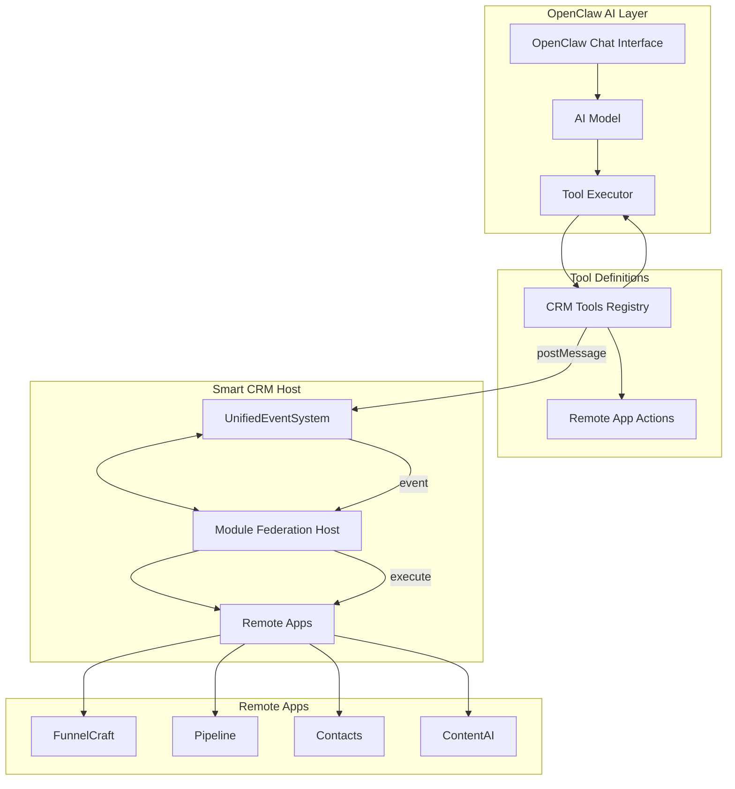
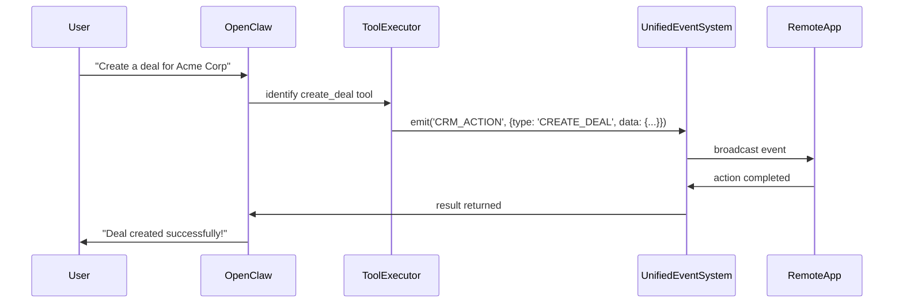

# OpenClaw Integration with Module Federation Apps

## Concept Overview

OpenClaw's AI chat can control Smart CRM's Module Federation remote apps through a **tool execution system**. When users chat with OpenClaw, the AI can invoke tools that trigger actions in remote apps via the UnifiedEventSystem.

---

## Architecture



---

## How It Works

### 1. OpenClaw Tools Definition

OpenClaw exposes "tools" that the AI can call. These tools map to CRM actions:

```typescript
// Example OpenClaw tool definitions for CRM actions
const crmTools = [
  {
    name: 'search_contacts',
    description: 'Search for contacts in the CRM',
    parameters: {
      query: 'search term',
      limit: 10
    }
  },
  {
    name: 'create_deal',
    description: 'Create a new deal in the pipeline',
    parameters: {
      name: 'deal name',
      value: 10000,
      stage: 'qualified'
    }
  },
  {
    name: 'update_task',
    description: 'Update a task status',
    parameters: {
      taskId: 'task-id',
      status: 'completed'
    }
  },
  {
    name: 'navigate_to_app',
    description: 'Navigate to a specific remote app',
    parameters: {
      app: 'funnelcraft|pipeline|contacts|contentai',
      route: '/specific-page'
    }
  },
  {
    name: 'trigger_workflow',
    description: 'Trigger an automation in a remote app',
    parameters: {
      workflowId: 'workflow-id',
      context: {}
    }
  }
];
```

### 2. Tool Execution Flow



### 3. Implementation

#### Step 1: Create CRM Tool Service

**File**: `client/src/services/openclawToolService.ts`

```typescript
import { unifiedEventSystem } from './unifiedEventSystem';

export interface OpenClawTool {
  name: string;
  description: string;
  parameters: Record<string, any>;
  category: 'crm' | 'navigation' | 'automation';
}

export const crmTools: OpenClawTool[] = [
  // Contact Management
  {
    name: 'search_contacts',
    description: 'Search contacts by name, email, or company',
    parameters: { query: 'string', limit: 'number' },
    category: 'crm'
  },
  {
    name: 'get_contact_details',
    description: 'Get detailed information about a contact',
    parameters: { contactId: 'string' },
    category: 'crm'
  },
  {
    name: 'create_contact',
    description: 'Create a new contact',
    parameters: { firstName: 'string', lastName: 'string', email: 'string', company: 'string' },
    category: 'crm'
  },
  
  // Deal Management
  {
    name: 'list_deals',
    description: 'List all deals in the pipeline',
    parameters: { stage: 'string?', limit: 'number?' },
    category: 'crm'
  },
  {
    name: 'create_deal',
    description: 'Create a new deal',
    parameters: { name: 'string', value: 'number', stage: 'string', contactId: 'string?' },
    category: 'crm'
  },
  {
    name: 'update_deal_stage',
    description: 'Move deal to a different pipeline stage',
    parameters: { dealId: 'string', stage: 'string' },
    category: 'crm'
  },
  
  // Task Management
  {
    name: 'list_tasks',
    description: 'List tasks for the current user',
    parameters: { status: 'string?', limit: 'number?' },
    category: 'crm'
  },
  {
    name: 'create_task',
    description: 'Create a new task',
    parameters: { title: 'string', dueDate: 'string', priority: 'string' },
    category: 'crm'
  },
  {
    name: 'complete_task',
    description: 'Mark a task as completed',
    parameters: { taskId: 'string' },
    category: 'crm'
  },
  
  // Navigation
  {
    name: 'navigate_to_app',
    description: 'Navigate to a specific app in the CRM',
    parameters: { app: 'string', route: 'string?' },
    category: 'navigation'
  },
  {
    name: 'open_remote_app',
    description: 'Open a Module Federation remote app',
    parameters: { appName: 'string', parameters: 'object?' },
    category: 'navigation'
  },
  
  // Automation
  {
    name: 'trigger_automation',
    description: 'Trigger a workflow automation',
    parameters: { workflowId: 'string', context: 'object' },
    category: 'automation'
  },
  {
    name: 'run_ai_insights',
    description: 'Get AI insights for a deal or contact',
    parameters: { entityType: 'string', entityId: 'string' },
    category: 'crm'
  }
];

export async function executeTool(toolName: string, parameters: any): Promise<any> {
  // Map tool names to UnifiedEventSystem events
  const eventMap: Record<string, string> = {
    'search_contacts': 'CRM:CONTACTS:SEARCH',
    'get_contact_details': 'CRM:CONTACTS:GET',
    'create_contact': 'CRM:CONTACTS:CREATE',
    'list_deals': 'CRM:DEALS:LIST',
    'create_deal': 'CRM:DEALS:CREATE',
    'update_deal_stage': 'CRM:DEALS:UPDATE_STAGE',
    'list_tasks': 'CRM:TASKS:LIST',
    'create_task': 'CRM:TASKS:CREATE',
    'complete_task': 'CRM:TASKS:COMPLETE',
    'navigate_to_app': 'NAV:ROUTE',
    'open_remote_app': 'NAV:REMOTE_APP',
    'trigger_automation': 'AUTOMATION:TRIGGER',
    'run_ai_insights': 'AI:INSIGHTS'
  };

  const eventType = eventMap[toolName];
  if (!eventType) {
    throw new Error(`Unknown tool: ${toolName}`);
  }

  // Emit event through UnifiedEventSystem
  const result = await unifiedEventSystem.emit(eventType, {
    tool: toolName,
    parameters,
    timestamp: Date.now()
  });

  return result;
}
```

#### Step 2: Register Tools with OpenClaw

The OpenClaw Next.js app needs to receive these tool definitions. This happens via API:

```typescript
// In OpenClaw's API route - /api/v1/tools
export async function GET() {
  const tools = crmTools.map(tool => ({
    name: tool.name,
    description: tool.description,
    parameters: tool.parameters,
    // OpenClaw categorizes: 'read' (auto-execute) vs 'write' (requires confirmation)
    action: tool.category === 'crm' ? 'read' : 'write'
  }));
  
  return Response.json({ tools });
}
```

#### Step 3: Handle Tool Execution

When OpenClaw executes a tool, it calls the Smart CRM API:

```typescript
// Smart CRM API route - /api/openclaw/execute
export async function POST(request: Request) {
  const { tool, parameters } = await request.json();
  
  const result = await executeTool(tool, parameters);
  
  return Response.json({ result });
}
```

#### Step 4: UnifiedEventSystem Listener

The UnifiedEventSystem receives events and dispatches to appropriate handlers:

```typescript
// In unifiedEventSystem.ts
export class UnifiedEventSystem {
  async emit(eventType: string, data: any): Promise<any> {
    switch (eventType) {
      case 'CRM:CONTACTS:SEARCH':
        return await this.handleContactSearch(data.parameters);
      case 'CRM:DEALS:CREATE':
        return await this.handleDealCreate(data.parameters);
      case 'NAV:ROUTE':
        return await this.handleNavigation(data.parameters);
      case 'NAV:REMOTE_APP':
        return await this.handleRemoteApp(data.parameters);
      // ... more handlers
      default:
        console.warn(`Unknown event type: ${eventType}`);
        return { error: 'Unknown event type' };
    }
  }
  
  private async handleRemoteApp(params: { appName: string; parameters?: any }): Promise<any> {
    // Broadcast to Module Federation remotes
    this.broadcast('REMOTE_APP:OPEN', {
      app: params.appName,
      ...params.parameters
    });
    
    return { success: true, app: params.appName };
  }
}
```

---

## Remote App Control Examples

### Example 1: Open FunnelCraft with Specific Campaign

User asks: "Show me the Q4 marketing campaign in FunnelCraft"

1. OpenClaw identifies `open_remote_app` tool
2. Calls API with `{ appName: 'funnelcraft', campaignId: 'q4-marketing' }`
3. UnifiedEventSystem broadcasts to remote app
4. FunnelCraft receives message and navigates to campaign

### Example 2: Create Deal from Conversation

User asks: "Create a $50,000 deal for John from Acme"

1. OpenClaw identifies `create_deal` tool
2. Calls API with `{ name: 'Acme - John', value: 50000, stage: 'qualified' }`
3. Smart CRM creates deal in database
4. Returns confirmation to OpenClaw
5. OpenClaw shows success message

### Example 3: Get AI Insights for Deal

User asks: "What are the insights for our biggest deal?"

1. OpenClaw identifies `run_ai_insights` tool
2. Calls API with `{ entityType: 'deal', entityId: 'deal-123' }`
3. Smart CRM runs AI analysis
4. Returns insights to OpenClaw
5. OpenClaw displays the insights

---

## Integration Checklist

- [ ] Create `openclawToolService.ts` with CRM tool definitions
- [ ] Add API route `/api/openclaw/execute` in Smart CRM
- [ ] Update UnifiedEventSystem to handle OpenClaw events
- [ ] Configure OpenClaw to register CRM tools
- [ ] Test tool execution flow
- [ ] Add confirmation UI for write operations
- [ ] Implement event broadcasting to Module Federation remotes

---

## Security Considerations

1. **Tool Authorization**: Only expose tools based on user permissions
2. **Confirmation for Writes**: Create/update/delete require user confirmation
3. **Rate Limiting**: Prevent tool spam
4. **Audit Logging**: Log all tool executions for security

---

## Files to Create/Modify

| Action | File | Description |
|--------|------|-------------|
| Create | `client/src/services/openclawToolService.ts` | Tool definitions & execution |
| Modify | `client/src/services/unifiedEventSystem.ts` | Add OpenClaw event handlers |
| Modify | `server/routes/openclaw.ts` | API route for tool execution |
| Modify | `client/src/components/Navbar.tsx` | Add OpenClaw app entry |
| Modify | `client/src/App.tsx` | Add OpenClaw chat route |

---

*Document Version: 1.0*
*Last Updated: March 2025*