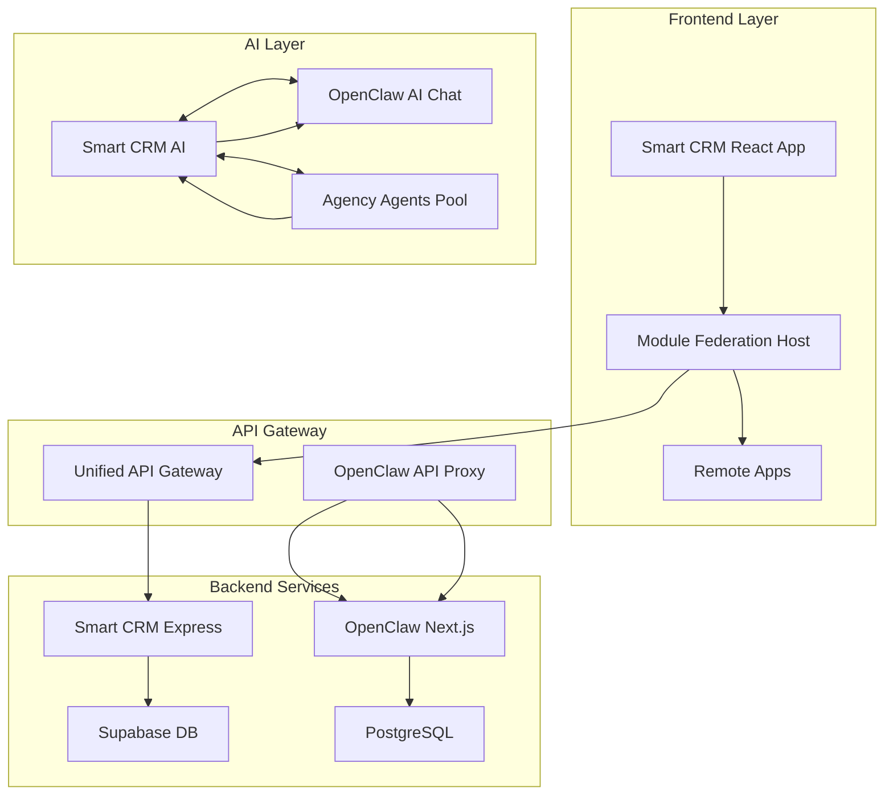

# Unified CRM System Blueprint - Complete Integration Plan

## Executive Summary

This blueprint documents the architecture for consolidating three repositories into a unified Smart CRM system:

1. **crm-smartreplit** - Main CRM with React/Node.js/Supabase (500+ features)
2. **openclaw-crm** - Next.js 15 monorepo with AI-first CRM API

---

## 1. Repository Analysis

### 1.1 crm-smartreplit (Current Workspace)

**Location**: `/workspaces/crm-smartreplit`

**Tech Stack**:

- Frontend: React 18 + TypeScript + Tailwind CSS
- Backend: Node.js + Express
- Database: Supabase (PostgreSQL) with RLS
- AI: OpenAI GPT-4/5, Google Gemini
- Integration: Module Federation, WebSocket, BroadcastChannel

**Key Features**:

- CRM Core: Contacts, Deals, Companies, Tasks, Activities
- AI Tools: 58+ AI features (email composer, proposals, forecasting)
- Communications: Email, Video Email, SMS, Phone, Calendar
- Analytics: Dashboards, pipeline health, revenue intelligence
- White Label: Multi-tenant with custom branding
- 8 Connected Remote Applications

### 1.2 openclaw-crm

**Location**: `/workspaces/smartcrm/external/openclaw-crm`

**Tech Stack**:

- Framework: Next.js 15 (App Router) + Turborepo
- Language: TypeScript
- Database: PostgreSQL 16 + Drizzle ORM
- Auth: Better Auth
- UI: shadcn/ui + Tailwind CSS v4
- AI: OpenRouter (Claude, GPT-4o, Llama, Gemini)

**Key Features**:

- People & Companies: 17 attribute types
- Deals & Pipeline: Drag-and-drop Kanban
- Custom Objects: Create your own object types
- Built-in AI Chat Agent: 8 read tools, 5 write tools
- 40+ REST API endpoints for AI agent integration
- Machine-readable docs: `/llms-api.txt`, `/openapi.json`

**API Endpoints**:
| Endpoint | Methods | Description |
|----------|---------|-------------|
| `/api/v1/objects` | GET, POST | List/create objects |
| `/api/v1/objects/:slug/records` | GET, POST | List/create records |
| `/api/v1/search` | GET | Full-text search |
| `/api/v1/chat/completions` | POST | AI chat (SSE stream) |
| `/api/v1/api-keys` | GET, POST | API key management |

**Agent Divisions**:
| Division | Agents | Use Case |
|----------|--------|----------|
| Engineering | 22 | Frontend, Backend, Mobile, AI, DevOps, Security |
| Design | 8 | UI, UX, Brand, Visual Storyteller |
| Paid Media | 7 | PPC, Search, Tracking, Creative |
| Sales | 8 | Outbound, Discovery, Deal Strategy, Proposals |
| Marketing | 32 | Content, Social, SEO, E-commerce |
| Product | 4 | Sprint, Trends, Feedback, Nudges |
| Project Management | 6 | Producer, Shepherd, Operations |
| Testing | 8 | QA, Performance, API, Accessibility |
| Support | 6 | Response, Analytics, Finance, Legal |
| Spatial Computing | 6 | XR, Vision Pro, WebXR |
| Specialized | 28 | MCP Builder, Compliance, Salesforce |
| Game Development | 20 | Unity, Unreal, Godot, Roblox |
| Academic | 5 | Anthropologist, Geographer, Historian |

---

## 2. Integration Architecture

### 2.1 System Overview



### 2.2 Integration Patterns

#### Pattern 1: API Federation

- Smart CRM exposes unified API
- OpenClaw API available as `/api/openclaw/*`
- Consistent authentication via JWT

#### Pattern 2: Agent Integration

- Agency agents integrated as AI skills
- OpenClaw chat capabilities embedded in Smart CRM
- Shared AI service layer

#### Pattern 3: Data Synchronization

- Optional: Sync contacts/deals between systems
- Use webhooks for real-time updates
- Or keep systems independent with shared UI

---

## 3. Feature Mapping

### 3.1 CRM Features Comparison

| Feature       | crm-smartreplit | openclaw-crm        | Integration        |
| ------------- | --------------- | ------------------- | ------------------ |
| Contacts      | ✅ Full         | ✅ People/Companies | Use Smart CRM      |
| Deals         | ✅ Full         | ✅ Kanban           | Use Smart CRM      |
| Tasks         | ✅ Full         | ✅ Tasks            | Use Smart CRM      |
| Notes         | ✅ Full         | ✅ Rich Text        | Use Smart CRM      |
| Custom Fields | ✅ Full         | ✅ 17 types         | Use OpenClaw       |
| AI Chat       | ✅ 58+ tools    | ✅ 13 tools         | Integrate both     |
| API for AI    | Limited         | ✅ 40+ endpoints    | Expose via Gateway |
| White Label   | ✅ Full         | ❌ None             | Use Smart CRM      |
| Multi-tenant  | ✅ Full         | ✅ Workspace        | Use Smart CRM      |

### 3.2 Recommended Approach

**Primary System**: crm-smartreplit (full-featured CRM)
**AI Enhancement**: openclaw-crm (AI chat + API)

---

## 4. Implementation Roadmap

### Phase 1: Infrastructure Setup

- [ ] Set up unified API gateway
- [ ] Configure shared authentication
- [ ] Establish database connections

### Phase 2: OpenClaw Integration

- [ ] Deploy OpenClaw Next.js app
- [ ] Create API proxy in Smart CRM
- [ ] Embed OpenClaw AI chat widget
- [ ] Connect 40+ API endpoints

### Phase 3: Unified Experience

- [ ] Single sign-on across apps
- [ ] Shared navigation and branding
- [ ] Cross-app data sharing (optional)
- [ ] Consolidated analytics

---

## 5. Technical Details

### 5.1 API Gateway Configuration

```typescript
// Unified API routes
/api/crm/*        -> Smart CRM Express API
/api/openclaw/*   -> OpenClaw Next.js API (proxied)
```

### 5.2 Authentication

- Smart CRM: Supabase Auth + JWT
- OpenClaw: Better Auth
- Solution: Unified auth via Supabase, federate to OpenClaw

### 5.3 AI Service Layer

```typescript
interface UnifiedAIService {
  // Smart CRM AI features
  composeEmail(context: EmailContext): Promise<string>;
  analyzeDeal(dealId: string): Promise<DealAnalysis>;

  // OpenClaw chat
  chat(message: string, history: Message[]): AsyncIterable<string>;
}
```

---

## 6. Repository Locations Summary

| Repository      | Path                                         | Status             |
| --------------- | -------------------------------------------- | ------------------ |
| crm-smartreplit | `/workspaces/crm-smartreplit`                | Primary            |
| openclaw-crm    | `/workspaces/smartcrm/external/openclaw-crm` | Integration target |

| ai-crm-agents | `/workspaces/ai-crm-agents` | Python agents (optional) |

---

## 7. Next Steps

1. **Confirm integration scope** - Which features from OpenClaw to expose?

2. **Design data flow** - Keep systems independent or sync data?
3. **Plan deployment** - Containerize both apps for production

---

_Document Version: 2.0_
_Last Updated: March 2025_
